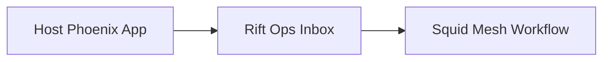

# Why

<!-- Describe the problem, business reason, or technical motivation. -->

<!-- What was broken, risky, limited, or worth changing now? -->

---

# What Changed

<!-- Summarize the final net diff: main code changes, new modules, refactors, migrations, config updates, or breaking changes. -->

---

# Architecture / Flow

<!-- Explain how the system behaves after this change. Add a Mermaid diagram when the change affects runtime flow, data flow, persistence, integration boundaries, or user-visible behavior. -->

## Diagram

<!-- Optional for docs/tooling-only changes. Required for runtime or user-visible behavior changes. -->

---

# How to Test

<!-- Include the exact commands you ran and relevant output. -->
<!-- If testing is not applicable, say why. -->
